```{r setup, include=FALSE}
options(htmltools.dir.version = FALSE)
knitr::opts_chunk$set(echo = FALSE,
                      message=FALSE,
                      warning= FALSE,
                      fig.width=10.4,
                      fig.height=7)
library(tidyverse)
library(lingtypology)
```

# Кто?

- Айгуль Закирова
- Нежъ Рошан
- Гарик Мороз
- Самира Ферхеес
- Стивен Кей

---
class: inverse, center, middle

# Где

---

# Где

Зило (Ботлихский район республики Дагестана)

**Андийский языки** < аваро-андийская группа < нахско-дагестанская семья

```{r, fig.height=5}
df <- read_tsv("villages2.csv")
map.feature(df$lang, 
            features = df$lang,
            label = df$label,
            label.hide = FALSE,
            label.fsize = 19,
            longitude = df$lon,
            latitude = df$lat,
            tile = "Stamen.TerrainBackground",
            minimap = TRUE,
            minimap.position = "topleft")
```

---

class: inverse, center, middle

# Что


---

# Чем занимались

- Валентностью и разбором текстов (Нэжъ)
- Согласованием (Айгуль, Стивен)
- Массивным опросом вариативности (Гарик)
- Указательными местоимениями... их очень много (Самира)

---

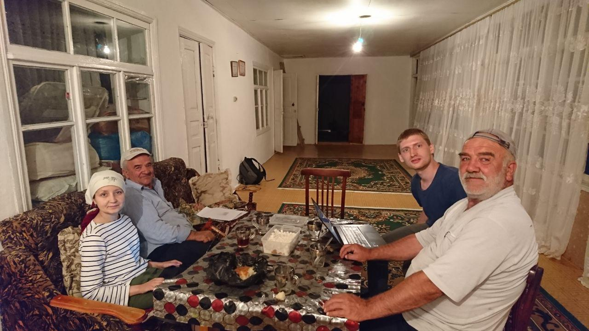

---

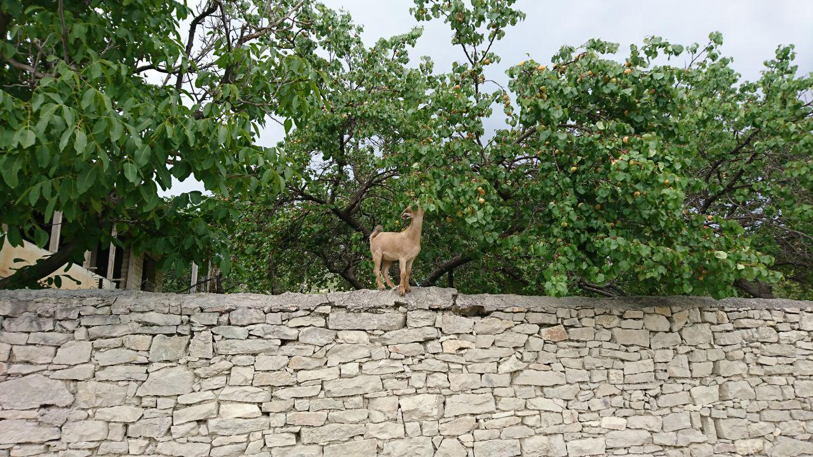
---

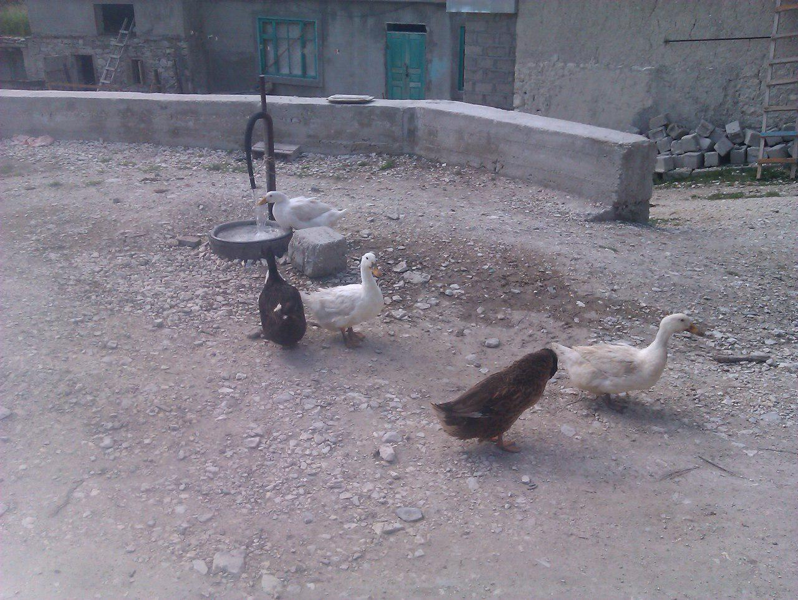
---

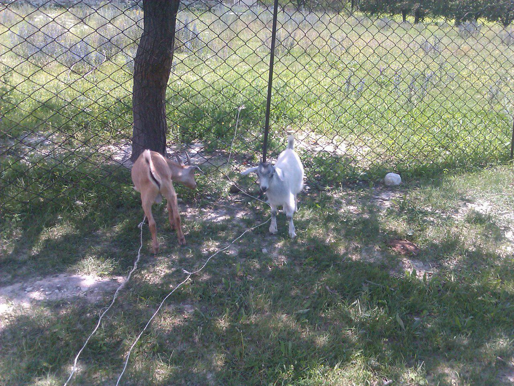

---

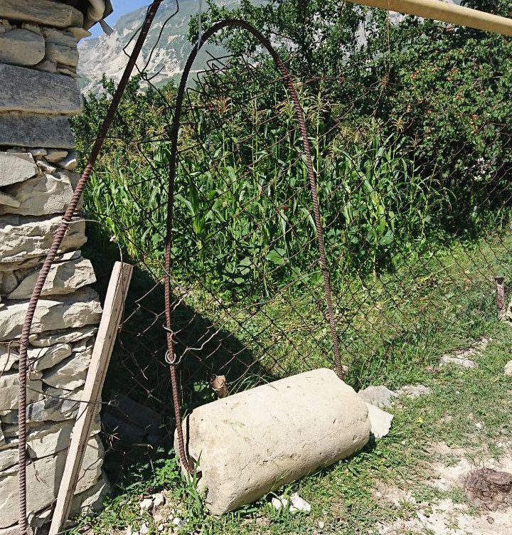

---

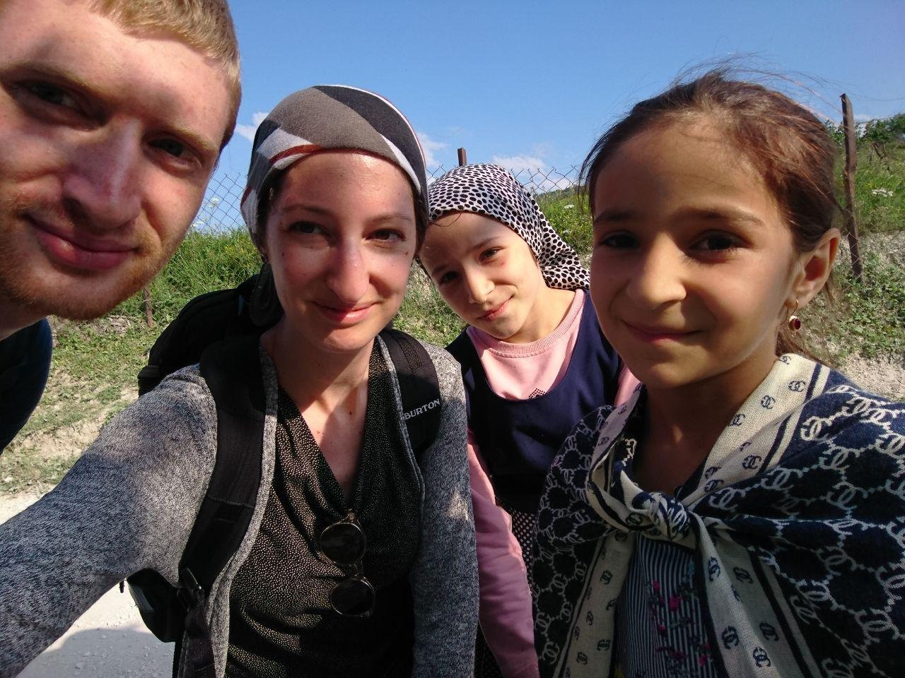

---

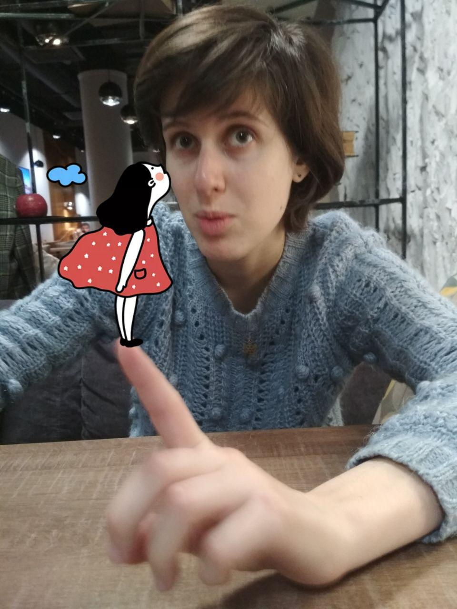

---

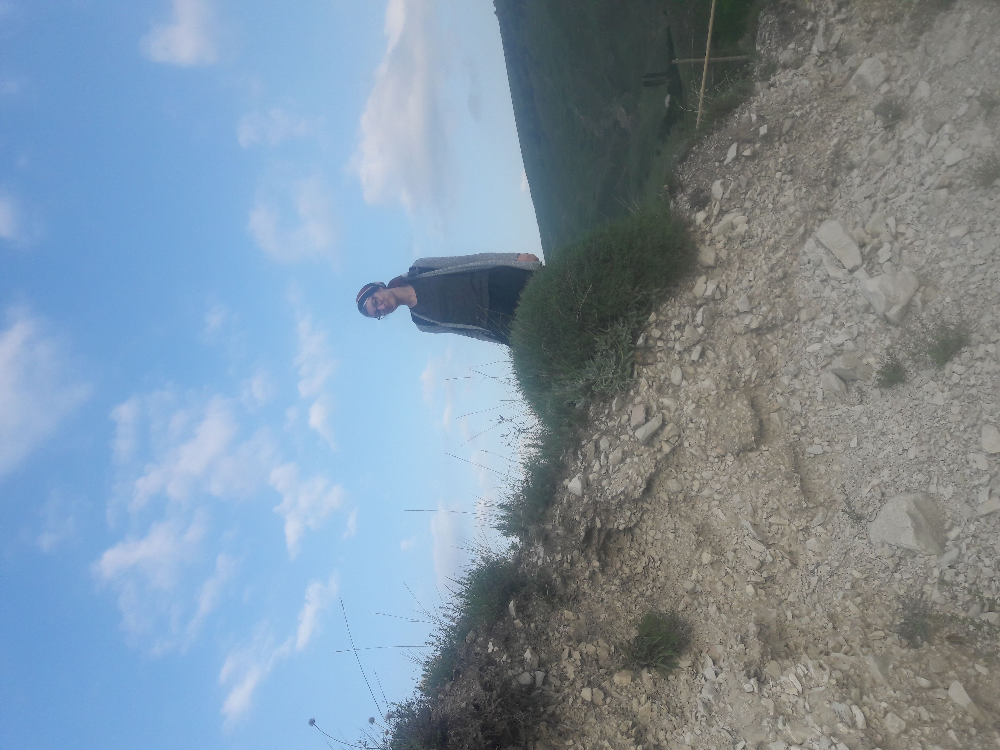


---

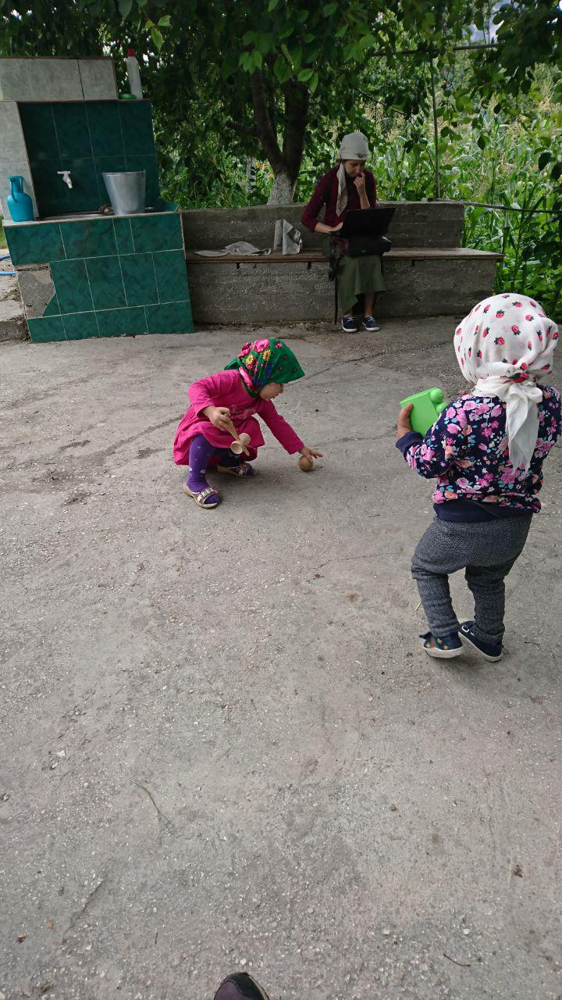

---

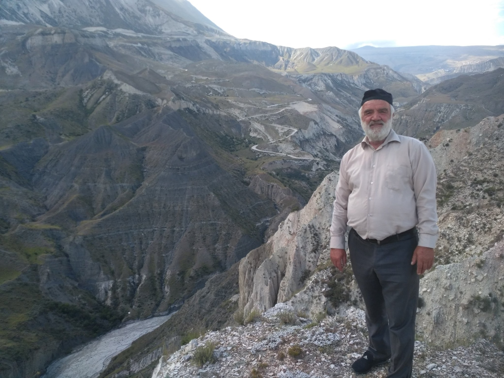


---
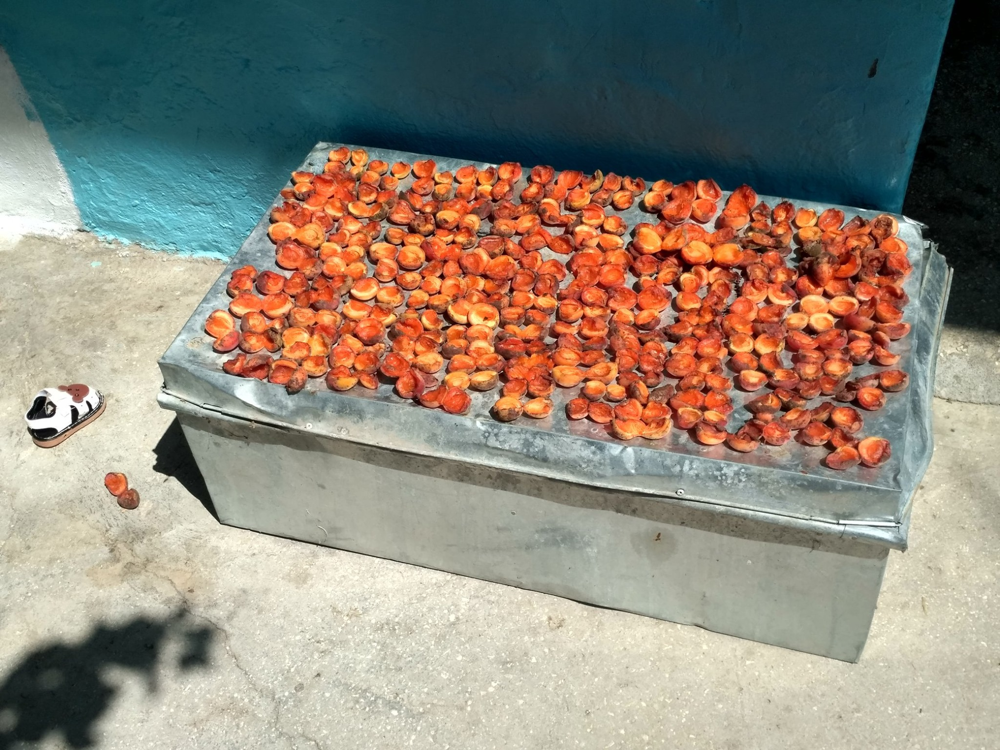

---
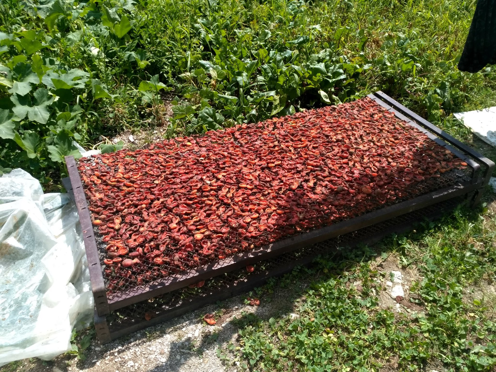

---
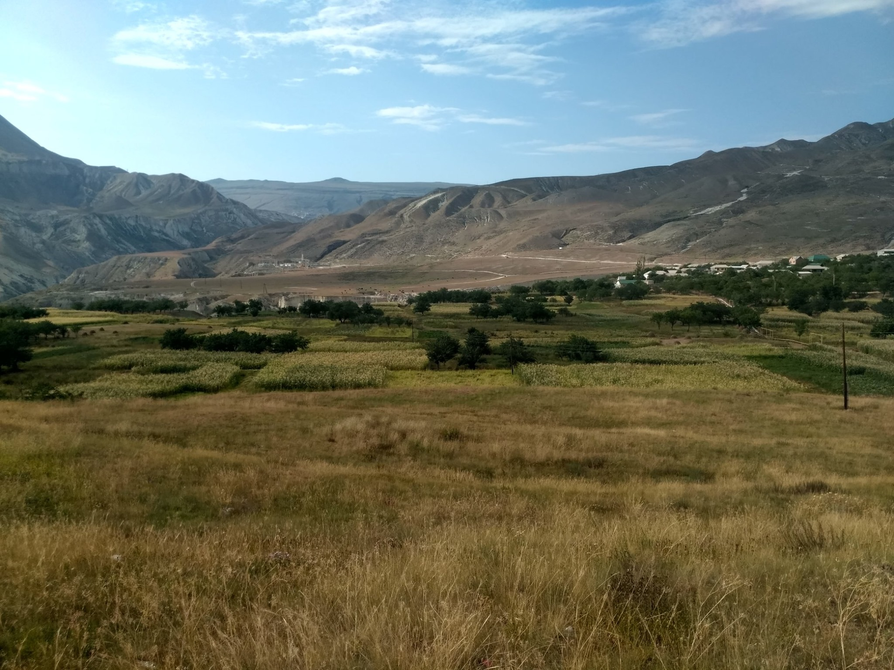

---

class: center, middle

# Спасибо за внимание!

Слайды сделаны с использованием следующих пакетов:

[**lingtypology**](https://ropensci.github.io/lingtypology/)

[**xaringan**](https://github.com/yihui/xaringan)

И фотографий Стивена Кея

Наша презентация на GitHub:

<https://agricolamz.github.io/2019.11.26_Zilo_fieldwork_prezi>
